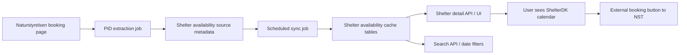

# NST Availability Platform for ShelterDK

## Goal

Give users access to Naturstyrelsen shelter availability directly on ShelterDK so they can:

- see booked/available dates without leaving ShelterDK
- search shelters by specific dates
- compare multiple shelters in the same UI

ShelterDK should **display availability** and **send users to Naturstyrelsen only for final booking**.

This phase is intentionally limited to **Naturstyrelsen-only**. No iframe. No `bookenshelter.dk` integration in v1.

## Why this model

The current model only knows whether a shelter:

- has a `booking_url`
- is heuristically "bookable"
- belongs to a provider such as Naturstyrelsen

That is enough for booking buttons, but not enough for:

- real availability calendars
- date search
- "available this weekend" style ranking

The correct next step is to create a separate **availability layer** beside the existing booking-link model.

## Constraints

### Product constraints

- Do not break current external booking flows
- Do not promise ShelterDK booking where booking still happens externally
- Keep all existing shelter content intact

### Technical constraints

- Availability must be fetched server-side
- Results must be cached
- Search must not call external providers live on every request

### Legal / operational constraints

- Start with Naturstyrelsen only
- Treat data as read-only availability data
- Do not scrape or proxy full booking sessions

## Current relevant system pieces

### Shelter detail rendering

- `/Users/CKA/shelterdk/shared/lib/shelter-detail.ts`
- `/Users/CKA/shelterdk/web/components/ShelterDetailContent.tsx`
- `/Users/CKA/shelterdk/web/components/ShelterFacts.tsx`
- `/Users/CKA/shelterdk/web/app/(site)/shelter/[slug]/page.tsx`
- `/Users/CKA/shelterdk/web/app/(site)/danmark/[region]/[municipality]/[shelter_slug]/page.tsx`

These already resolve booking presentation from:

- `booking_provider`
- `booking_link_mode`
- `booking_url`
- `booking_lookup_key`

This is the right place to add availability metadata too.

### ShelterDK internal booking availability

- `/Users/CKA/shelterdk/web/app/api/book/[slug]/availability/route.ts`
- `/Users/CKA/shelterdk/web/components/booking/BookingForm.tsx`
- `/Users/CKA/shelterdk/web/components/booking/BookingCalendar.tsx`

This already gives ShelterDK-owned shelters a usable availability API and calendar. External provider availability should align with this shape as much as possible.

### Search stack

- `/Users/CKA/shelterdk/web/app/api/soeg/route.ts`
- `/Users/CKA/shelterdk/web/lib/soeg-db.ts`
- `/Users/CKA/shelterdk/web/components/SoegContent.tsx`

This is where later date-based filtering should be integrated. Do not hit Naturstyrelsen live from search.

## Proposed architecture



## Phase 1 scope

### Included

- Naturstyrelsen shelter availability only
- server-side fetch of booked dates
- cache in ShelterDK database
- own calendar UI on shelter detail pages
- basic date search against cached data

### Excluded

- external booking checkout inside ShelterDK
- `bookenshelter.dk`
- generic scraping framework for all providers
- price parsing
- per-person occupancy rules

## Data model

### 1. Extend `shelters`

Add availability source metadata to the existing shelter rows.

Suggested fields:

- `availability_provider text`
- `availability_mode text`
- `availability_lookup_key text`
- `availability_url text`
- `availability_verified_at timestamptz`
- `availability_confidence text`

Suggested enums:

- `availability_provider`
  - `shelterdk`
  - `naturstyrelsen`
  - `unknown`

- `availability_mode`
  - `internal_live`
  - `external_cached`
  - `external_unknown`
  - `none`

- `availability_confidence`
  - `manual`
  - `imported`
  - `verified_match`
  - `heuristic`

For NST:

- `availability_provider = naturstyrelsen`
- `availability_mode = external_cached`
- `availability_lookup_key = PID`
- `availability_url = book.naturstyrelsen.dk/sted/...`

### 2. New table: `external_availability_snapshots`

One row per shelter per sync run.

Suggested columns:

- `id uuid primary key`
- `shelter_id uuid not null`
- `provider text not null`
- `lookup_key text not null`
- `as_of_date date not null`
- `fetched_at timestamptz not null default now()`
- `status text not null`
- `error_message text null`
- `payload jsonb not null default '{}'::jsonb`

Purpose:

- raw-ish source snapshot for debugging
- traceability
- provider error visibility

### 3. New table: `external_availability_days`

Normalized daily availability index.

Suggested columns:

- `shelter_id uuid not null`
- `provider text not null`
- `day date not null`
- `state text not null`
- `fetched_at timestamptz not null default now()`
- primary key `(shelter_id, provider, day)`

Suggested `state` values:

- `booked`
- `partial`
- `available`
- `unknown`

For NST v1 we mainly need:

- `booked`
- optionally infer `available` only for a bounded horizon

### 4. Optional sync-health table

If we want richer monitoring later:

- `external_availability_sync_runs`

This can be deferred because booking monitor/email log already exist.

## Naturstyrelsen-specific ingestion model

### What we know

The booking pages expose a provider-specific internal ID (`PID`) in the HTML.

Availability can be fetched from an NST endpoint with:

- `i = PID`
- `d = YYYYMMDD`

The response includes:

- `BookingDates`
- `PartialBookingDates`
- possibly provider-specific holder fields

### What we need to store

For each NST shelter:

- concrete booking URL
- `PID`

### How to get PID

Build a script that:

1. selects shelters where:
   - `booking_provider = naturstyrelsen`
   - `booking_url is not null`
2. fetches the booking page HTML
3. extracts PID from the page
4. stores it in:
   - `availability_provider = naturstyrelsen`
   - `availability_mode = external_cached`
   - `availability_lookup_key = PID`
   - `availability_url = booking_url`

This should write only when extraction succeeds.

## Sync model

### Scheduled sync job

Add a cron/API route that:

1. selects NST shelters with `availability_lookup_key`
2. fetches availability for a rolling date window
3. writes normalized day rows into `external_availability_days`
4. stores snapshot/debug payload in `external_availability_snapshots`
5. records failures in booking monitor

### Sync horizon

Start with:

- `today -> today + 120 days`

Why 120:

- enough for meaningful user planning
- smaller payloads
- easier to keep fresh

Can later move to 180 or 365 if needed.

### Sync frequency

Start with:

- full sync every 6 hours
- on-demand refresh for an individual shelter if cached data is stale

Suggested staleness thresholds:

- shelter detail page: tolerate up to 6 hours stale
- search results: tolerate up to 12 hours stale

## Internal API design

### 1. Provider-independent shelter availability endpoint

New route:

- `/api/shelter-availability/[slug]`

Returns a unified format for both:

- ShelterDK internal bookable shelters
- NST external cached shelters

Suggested response:

```json
{
  "provider": "naturstyrelsen",
  "mode": "external_cached",
  "source_url": "https://book.naturstyrelsen.dk/sted/jomfruhale-shelterplads/",
  "last_synced_at": "2026-05-16T10:00:00Z",
  "days": {
    "2026-05-14": "booked",
    "2026-05-15": "booked",
    "2026-05-16": "available"
  },
  "stale": false
}
```

### 2. Search-facing availability query path

Do not query provider endpoints live from `/api/soeg`.

Instead:

- query `external_availability_days`
- filter shelters by requested range

Suggested search params later:

- `check_in=2026-07-12`
- `check_out=2026-07-14`

Logic:

- shelter is available if none of the nights in the interval are `booked`
- `partial` handling can be added later

## UI design

### Shelter detail page

For NST shelters with cached availability:

- show ShelterDK-style calendar
- show label like:
  - `Ledighed fra Naturstyrelsen`
- keep CTA:
  - `Book på Naturstyrelsen`

This keeps the model honest:

- ShelterDK shows the calendar
- NST handles the booking

### Search page

Add optional date filter UI after phase 1 detail-page rollout.

Suggested UX:

- `Ankomst`
- `Afrejse`

Search behavior:

- if both dates set, filter results by cached availability
- only apply to shelters where we actually have availability data

For shelters without availability integration yet:

- either exclude them from date-filtered search
- or show them under a separate “ukendt ledighed” section

Recommendation:

- exclude them in v1 when date filtering is active
- show a small note: `Viser shelters med kendt ledighed`

## Search strategy

### Why not compute on the fly

`/api/soeg` already handles:

- text search
- region filtering
- bbox filtering
- many feature flags

Adding live provider calls would make it:

- slow
- flaky
- expensive

### Recommended search implementation

When date filters are present:

1. compute requested night set
2. query `external_availability_days`
3. get matching shelter IDs
4. intersect with current search result set

This can be done with:

- SQL CTE
- materialized helper query
- or a small helper in `soeg-db.ts`

### Performance notes

Index `external_availability_days` on:

- `(day, state)`
- `(shelter_id, day)`
- maybe `(provider, day)`

## Implementation phases

### Phase A — metadata foundation

Deliverables:

- migration for availability columns + tables
- PID extraction script for NST shelters
- first backfill of `availability_lookup_key`

Success criteria:

- at least one known NST shelter has a stored PID
- sync can fetch and persist booked days

### Phase B — shelter detail availability

Deliverables:

- sync route/job
- unified availability API
- NST calendar on shelter detail page

Success criteria:

- Jomfruhale and 2-3 more NST shelters show correct booked days on ShelterDK
- booking CTA still sends users to NST

### Phase C — date search

Deliverables:

- add `check_in` / `check_out` to search API
- add search UI controls
- filter to shelters with known availability

Success criteria:

- user can search a date range and get a meaningful set of available NST shelters

### Phase D — quality and operations

Deliverables:

- staleness badges / fallback messages
- monitor alerts for failed syncs
- admin diagnostics page for provider sync health

Success criteria:

- ops can see which NST shelters failed availability sync

## Failure handling

If availability fetch fails:

- keep last successful cached days
- mark the shelter response `stale = true`
- show small note in UI:
  - `Ledighed senest opdateret for X timer siden`

If no availability data exists yet:

- do not show empty fake calendar
- fall back to existing booking box behavior

## Important product rules

1. Never mark an external shelter as bookable on ShelterDK just because we have availability data.
2. Never hide the external booking URL when we know it.
3. Availability and booking link are separate concepts.
4. Search by date must only rely on cached, normalized data.

## Better models and why this one wins

### Option 1: iframe

Pros:

- very fast to ship

Cons:

- no search
- no unified UI
- fragile UX
- no real product advantage

Verdict:

- not recommended

### Option 2: runtime scraping in browser

Pros:

- low backend work

Cons:

- CORS
- fragility
- poor performance
- no reusable search index

Verdict:

- bad model

### Option 3: server-side cached availability integration

Pros:

- enables ShelterDK-native calendar
- enables date search
- resilient
- observable

Cons:

- more backend work

Verdict:

- best realistic model

## Recommended immediate next step

Implement Phase A only:

1. migration for availability fields/tables
2. NST PID extraction script
3. one test sync for 3 known NST shelters

This is the smallest slice that proves:

- we can identify NST shelters reliably
- we can fetch availability
- we can store it in a form usable by UI and search

Only after that should we build the calendar UI.
